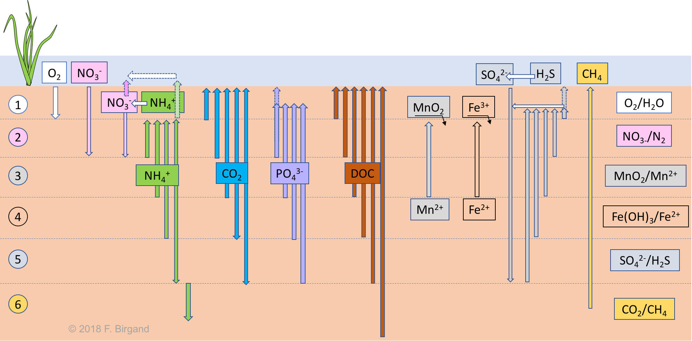

# Code chunks

So this is one of the great beauties of the `R markdown` platform: You insert text, equations, and code chunks! Code chunks are used to run `R` code, `python` code, and others such as `C` and `fortran` codes! In `bookdown`, one also uses them to insert pictures, videos, and tables.

## Inserting pictures

This code:

<pre><code>```{r "diagenesis-diffusion-directions", eval=TRUE, echo=FALSE, out.width = '100%', fig.align = 'center', fig.cap="Diffusion fluxes of electron acceptors and all other soil diagenesis processes of a theoretical layered wetland soil"}

```</code></pre>

yields:

```{r "diagenesis-diffusion-directions", eval=TRUE, echo=FALSE, out.width = '100%', fig.align = 'center', fig.cap="Diffusion fluxes of electron acceptors and all other soil diagenesis processes of a theoretical layered wetland soil"}

```

So the first thing in the code is its name. It then becomes possible to reference the figure using `Figure \@ref(fig:diagenesis-diffusion-directions)` to say: look at the cool stuff in Figure \@ref(fig:diagenesis-diffusion-directions). Then, there are other settings for the code, which are detailed below. The figure caption is announced with the `fig.cap=`.

## Inserting several pictures

It is also possible to insert several pictures lined up using this code:

<pre><code>```{r "brickwall", echo=FALSE, out.width = '40%', fig.show = 'hold', fig.align = 'center', fig.cap="Small and large structures can be built from the addition of bricks, one at a time"}
knitr::include_graphics(c("pictures/brickwall.png","pictures/brick-skyscraper.jpg"))
```</code></pre>

which yields:

```{r "brickwall", echo=FALSE, out.width = '40%', fig.show = 'hold', fig.align = 'center', fig.cap="Small and large structures can be built from the addition of bricks, one at a time"}
knitr::include_graphics(c("pictures/brickwall.png","pictures/brick-skyscraper.jpg"))
```

## Inserting videos

Similarly, it is possible to insert videos from the web using this code:

<pre><code>```{r "ATPaseRotation", echo=FALSE, out.width = '80%', fig.align = 'center', fig.cap="ATP synthase in action. Obtained with permission from HarvardX"}
knitr::include_url("https://www.youtube.com/embed/kXpzp4RDGJI")
```</code></pre>

which yields:

```{r "ATPaseRotation", echo=FALSE, out.width = '80%', fig.align = 'center', fig.cap="ATP synthase in action. Obtained with permission from HarvardX"}
knitr::include_url("https://www.youtube.com/embed/kXpzp4RDGJI")
```

## Inserting R code

And obviously, a nice thing about `R markdown` is to be able to insert `R` code chunks like the one below to make some pretty complicated figures (the one here is not that much, and is not particularly well written...)

<pre><code>```{r "molarfracPO4", echo=FALSE, out.width = '85%', fig.align = 'center', fig.cap="Molar fraction for the conjugate acid forms of the triprotic phosphoric acid in dilute solutions at 25°C"}
pKa=c(2.12,7.21,12.67)
forms=c("H3PO4","H2PO4","HPO4","PO4")

#if (length(forms)=4){
pH<-seq(0,14,by=0.01)
denominator= 10^(-3*pH)+ 10^(-pKa[1])*10^(-2*pH)+10^(-pKa[1])*10^(-pKa[2])*10^(-pH)+ 10^(-pKa[1])*10^(-pKa[2])*10^(-pKa[3])
alpha0=10^(-3*pH)/denominator
alpha1=(10^(-2*pH)*10^(-pKa[1]))/denominator
alpha2=(10^(-pH)*10^(-pKa[1])*10^(-pKa[2]))/denominator
alpha3=10^(-pKa[1])*10^(-pKa[2])*10^(-pKa[3])/denominator

couleur=c("darkgreen","blue","orange","red","black")
Ylim<-c(0,1.2)
Xlim<-c(0,14)
plot(0,0,xlim=Xlim,ylim=Ylim,col="white",main="",xlab="",ylab="",bty="n",xaxt="n",yaxt="n")
abline(h=0,lwd=2,col="grey")
par(new=TRUE)
abline(h=seq(0,1,by=0.1),lty=3,col="grey")
abline(h=1,lty=1,lwd=1,col="grey")
abline(v=seq(0,14,by=1),lty=3,col="grey")
par(new=TRUE)

   plot(pH,alpha0,xlim=Xlim,ylim=Ylim,lty=1,lwd=2,type="l",xlab="pH",ylab="alpha",yaxt="n",col=couleur[1])
   par(new=TRUE)
   plot(pH,alpha1,xlim=Xlim,ylim=Ylim,lty=1,lwd=2,type="l",xlab="",ylab="",xaxt="n",yaxt="n",col=couleur[2])
   par(new=TRUE)
   plot(pH,alpha2,xlim=Xlim,ylim=Ylim,lty=1,lwd=2,type="l",xlab="",ylab="",xaxt="n",yaxt="n",col=couleur[3])
   par(new=TRUE)
   plot(pH,alpha3,xlim=Xlim,ylim=Ylim,lty=1,lwd=2,type="l",xlab="",ylab="",xaxt="n",yaxt="n",col=couleur[4])
   axis(2,,at=c(0,0.2,0.4,0.6,0.8,1),labels=c("0","0.2","0.4","0.6","0.8","1"),cex.axis=1)
   par(new=TRUE)
   text(1,1.1,expression(paste(H[3],PO[4])),cex=1.2,col=couleur[1])
   par(new=TRUE)
   text((pKa[2]-pKa[1])/2+pKa[1],1.1,substitute(paste(H[x],PO[y]^{z}),list(x=2,y=4,z="-")),adj=0.5,cex=1.2,col=couleur[2])
   par(new=TRUE)
   text((pKa[3]-pKa[2])/2+pKa[2],1.1,substitute(paste(HPO[y]^{z}),list(y=4,z="2-")),cex=1.2,adj=0.5,col=couleur[3])
   par(new=TRUE)
   text(14,1.1,substitute(paste(PO[y]^{z}),list(y=4,z="3-")),adj=1,cex=1.2,col=couleur[4])
```</code></pre>

which yields:

```{r "molarfracPO4", echo=FALSE, out.width = '85%', fig.align = 'center', fig.cap="Molar fraction for the conjugate acid forms of the triprotic phosphoric acid in dilute solutions at 25°C"}
pKa=c(2.12,7.21,12.67)
forms=c("H3PO4","H2PO4","HPO4","PO4")

#if (length(forms)=4){
pH<-seq(0,14,by=0.01)
denominator= 10^(-3*pH)+ 10^(-pKa[1])*10^(-2*pH)+10^(-pKa[1])*10^(-pKa[2])*10^(-pH)+ 10^(-pKa[1])*10^(-pKa[2])*10^(-pKa[3])
alpha0=10^(-3*pH)/denominator
alpha1=(10^(-2*pH)*10^(-pKa[1]))/denominator
alpha2=(10^(-pH)*10^(-pKa[1])*10^(-pKa[2]))/denominator
alpha3=10^(-pKa[1])*10^(-pKa[2])*10^(-pKa[3])/denominator

couleur=c("darkgreen","blue","orange","red","black")
Ylim<-c(0,1.2)
Xlim<-c(0,14)
plot(0,0,xlim=Xlim,ylim=Ylim,col="white",main="",xlab="",ylab="",bty="n",xaxt="n",yaxt="n")
abline(h=0,lwd=2,col="grey")
par(new=TRUE)
abline(h=seq(0,1,by=0.1),lty=3,col="grey")
abline(h=1,lty=1,lwd=1,col="grey")
abline(v=seq(0,14,by=1),lty=3,col="grey")
par(new=TRUE)

   plot(pH,alpha0,xlim=Xlim,ylim=Ylim,lty=1,lwd=2,type="l",xlab="pH",ylab="alpha",yaxt="n",col=couleur[1])
   par(new=TRUE)
   plot(pH,alpha1,xlim=Xlim,ylim=Ylim,lty=1,lwd=2,type="l",xlab="",ylab="",xaxt="n",yaxt="n",col=couleur[2])
   par(new=TRUE)
   plot(pH,alpha2,xlim=Xlim,ylim=Ylim,lty=1,lwd=2,type="l",xlab="",ylab="",xaxt="n",yaxt="n",col=couleur[3])
   par(new=TRUE)
   plot(pH,alpha3,xlim=Xlim,ylim=Ylim,lty=1,lwd=2,type="l",xlab="",ylab="",xaxt="n",yaxt="n",col=couleur[4])
   axis(2,,at=c(0,0.2,0.4,0.6,0.8,1),labels=c("0","0.2","0.4","0.6","0.8","1"),cex.axis=1)
   par(new=TRUE)
   text(1,1.1,expression(paste(H[3],PO[4])),cex=1.2,col=couleur[1])
   par(new=TRUE)
   text((pKa[2]-pKa[1])/2+pKa[1],1.1,substitute(paste(H[x],PO[y]^{z}),list(x=2,y=4,z="-")),adj=0.5,cex=1.2,col=couleur[2])
   par(new=TRUE)
   text((pKa[3]-pKa[2])/2+pKa[2],1.1,substitute(paste(HPO[y]^{z}),list(y=4,z="2-")),cex=1.2,adj=0.5,col=couleur[3])
   par(new=TRUE)
   text(14,1.1,substitute(paste(PO[y]^{z}),list(y=4,z="3-")),adj=1,cex=1.2,col=couleur[4])
```

## Inserting tables

To me, this is where Rmarkdown is the weakest for now. Tables are not that easy to handle... Here is a Chunk code that works with `pander`. I had to use this because otherwise, it would not render the equations well, but it does not have a caption, which is what I was trying to have anyway.


<pre><code>```{r "EqKH2O", echo=FALSE, warning=FALSE, eval=TRUE}
EquiK<-read.csv("EqKH2O.csv", header = TRUE)

library(pander)
panderOptions('keep.trailing.zeros', TRUE)
pander(EquiK, style = "rmarkdown", split.table = Inf,
       col.names = c("Equilibrium reactions","Log K"))
```</code></pre>

</br></br>

```{r "EqKH2O", echo=FALSE, warning=FALSE, eval=TRUE}
EquiK<-read.csv("EqKH2O.csv", header = TRUE)

library(pander)
panderOptions('keep.trailing.zeros', TRUE)
pander(EquiK, style = "rmarkdown", split.table = Inf,
       col.names = c("Equilibrium reactions","Log K"))
```

There is another package which I like in many ways, but it is still imperfect: `KableExtra`. In the code below, it is possible to insert picture with text.

<pre><code>```{r "ElecAllocTab", echo=FALSE, warning=FALSE}
elecalloc<-read.csv("ElecAlloc1.csv", header = TRUE)
library(kableExtra)
knitr::kable(elecalloc, align = "c", "html",
             caption = 'Examples of electron allocations on the C, N, S, and P atoms generating different inorganic and organic molecules relevant to environmental and ecological engineering',
             col.names = c("Nb of e^-^ stored on the atoms","C","N","S","P")) %>%
      kable_styling(full_width = F) %>%
  column_spec(1, bold = T, border_right = T, width = "5em") %>%
  column_spec(2, width = "15em") %>%
  column_spec(3, width = "10em") %>%
  column_spec(4, width = "10em") %>%
  column_spec(5, width = "10em", border_right = T) %>%
  row_spec(1:9, background = "white")
```</code></pre>

The beauty is that I was able to get the caption here and this is very useful. I suppose that for most applications, `KableExtra` is still the best thing outthere. Again, to reference the table, use `\@ref(tab:ElecAllocTab)` to say that table \@ref(tab:ElecAllocTab) is very messy!!

</br>

```{r "ElecAllocTab", echo=FALSE, warning=FALSE}
elecalloc<-read.csv("ElecAlloc1.csv", header = TRUE)
library(kableExtra)
knitr::kable(elecalloc, align = "c", "html",
             caption = 'Examples of electron allocations on the C, N, S, and P atoms generating different inorganic and organic molecules relevant to environmental and ecological engineering',
             col.names = c("Nb of e^-^ stored on the atoms","C","N","S","P")) %>%
      kable_styling(full_width = F) %>%
  column_spec(1, bold = T, border_right = T, width = "5em") %>%
  column_spec(2, width = "15em") %>%
  column_spec(3, width = "10em") %>%
  column_spec(4, width = "10em") %>%
  column_spec(5, width = "10em", border_right = T) %>%
  row_spec(1:9, background = "white")
```


## Other important things about code chunks

Code chunks (but not inline code) can take a lot of **options** which modify
how they are run, and how they appear in the document.  These options go after
the initial `r` and before the closing `}` that announces the start of a code
chunk.  One of the most common options turns off printing out the code,
but leaves the results alone:
 ` ```{r, echo=FALSE} `
<br/>
Another runs the code, but includes neither the text of the code nor its output.
 ` ```{r, include=FALSE} `
This might seem pointless, but it can be useful for code chunks which do set-up
like loading data files, or initial model estimates, etc.

<br/>
Another option prints the code in the document, but does not run it:
 ` ```{r, eval=FALSE} `
This is useful if you want to talk about the (nicely formatted) code.
<br/>
Another option on the results of the code is that it generate all results "as-is", which is very nice when your code generates mark-up text to be rendered by `Pandoc`. 

 ` ```{r, results="asis"} `
<br/>
By default, the results of a chunk with have `##` as a prefix. You can remove this by putting 

 ` ```{r, comment=FALSE} `

<br/>
Sometimes, running of the code will generate warnings and messages.  These can be turned off in the output by using

 ` ```{r, warning=FALSE, message = FALSE} `
 

## Naming Chunks

You can give chunks names immediately after their opening, like
` ```{r, clevername} `.  This name is then used for the images (or other files)
that are generated when the document is rendered.

## Adjusting figure sizes and alignments

These details are discussed in the accompanying written article on instantaneous vs. interval-average flow data.


#### "Caching" Code Chunks (Re-Running Only When Changed)

By default, R Markdown will re-run all of your code every time you render your
document.  If some of your code is slow, this can add up to a lot of time.  You
can, however, ask R Markdown to keep track of whether a chunk of code has
changed, and only re-run it if it has.  This is called **caching** the chunk.

<pre><code>```{r, cache=TRUE}
summary(cars)
```</code></pre>

```{r, cache=TRUE}
summary(cars)
```

One issue is that a chunk of code which hasn't changed itself might call on
results of earlier, modified chunks, and then we _would_ want to re-run the
downstream chunks.  There are options for manually telling R Markdown "this
chunk depends on this earlier chunk", but it's generally easier to
let it take care of that, by setting the `autodep=TRUE` option.

1. If you load a package with the `library()` command, R
   Markdown isn't smart enough to check whether the package has changed
   (or indeed been installed, if you were missing it).  So that won't
   trigger an automatic re-running of a cached code chunk.
2. To manually force re-running all code chunks, the easiest thing to do is
   to delete the directory R Markdown will create (named something like
   _filename_`_cache`) which it uses to store the state of all code chunks.

<br/>

#### Setting Defaults for All Chunks

You can tell R to set some defaults to apply to all chunks where you don't
specifically over-ride them.  Here are the ones I generally use:

<pre><code>```{r, eval=FALSE}
# Need the knitr package to set chunk options
library(knitr)

# Set knitr options for knitting code into the report:
# - Don't print out code (echo)
# - Save results so that code blocks aren't re-run unless code changes (cache),
# _or_ a relevant earlier code block changed (autodep), but don't re-run if the
# only thing that changed was the comments (cache.comments)
# - show the error messages (message)
# - Don't clutter R output with warnings (warning)
# This _will_ leave error messages showing up in the knitted report
opts_chunk$set(echo=FALSE,
               cache=TRUE, autodep=TRUE, cache.comments=FALSE,
               message=TRUE, warning=FALSE)
```</code></pre>

This sets some additional options beyond the ones I've discussed, like not
re-running a chunk if only the comments have changed (`cache.comments =
FALSE`), and leaving out messages and warnings.  (I'd only recommend
suppressing warnings once you're sure your code is in good shape.)  I would
typically give this set-up chunk itself the option `include=FALSE`.

You can over-ride these defaults by setting options for individual chunks.

<br/>

#### More Chunk options

See [http://yihui.name/knitr/options/] for a complete listing of possible chunk options.

